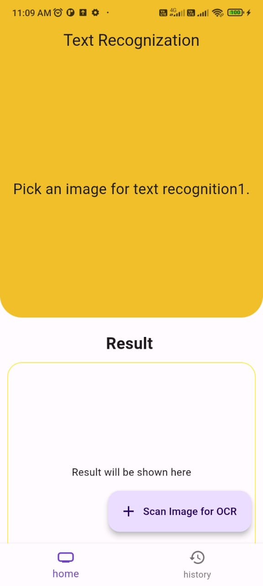
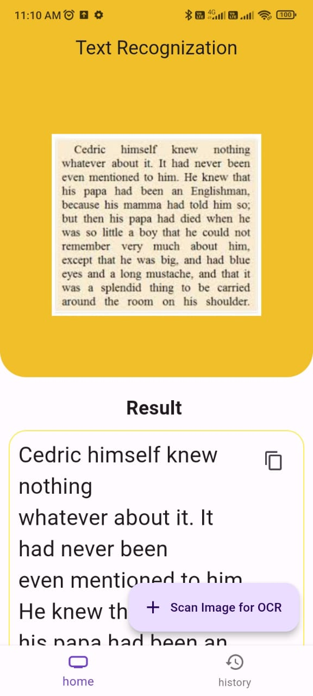
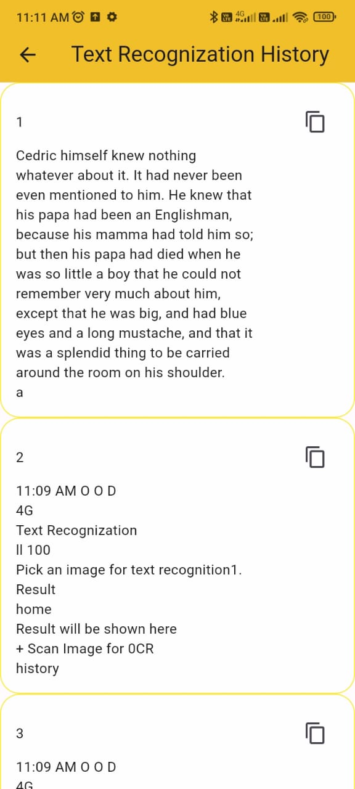

# kyc_ocr

Empower Your KYC Experience: Fluttering into the Future with Seamless Document Scanning and OCR Magic!

## Getting Started

This project is a starting point for a Flutter application.

Revolutionize KYC effortlessly with our Flutter-powered mobile app. Scan Aadhar, PAN, Voter ID, and DL documents seamlessly using Dart language. Experience the power of OCR technology to extract accurate text information. Your ID verification simplified, right at your fingertips! Trust Flutter for a swift and secure KYC process

Steps

Click on Scan a Image (floatingbutton)
Choose an Image from local Storage

Data will be printed below like this

Also as number of time you scan images it store its data into history page.
